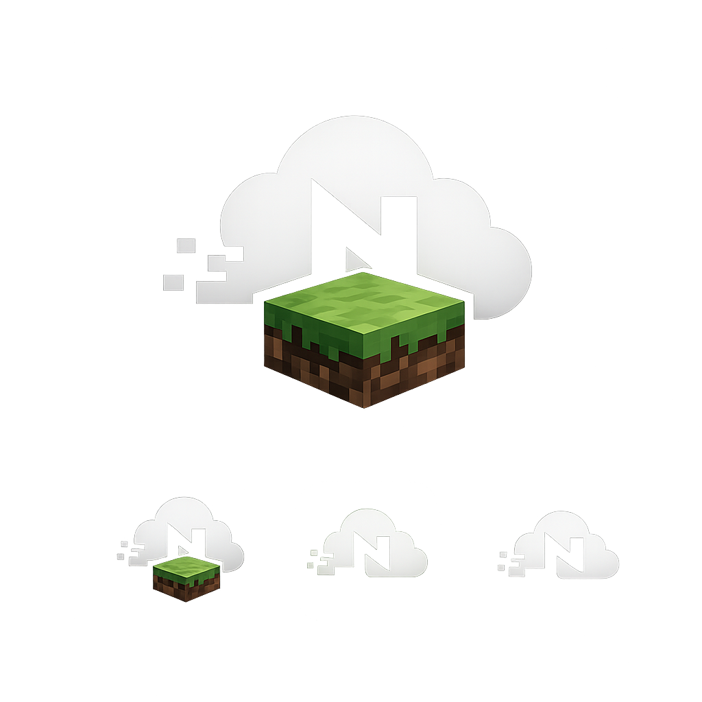

<div align="center">



# Nimbus Launcher

**A modern Minecraft modpack launcher with a full web platform**

[](https://github.com/tavimxlseven/NimbusLauncher/releases)
[](https://www.electronjs.org/)
[](https://rubyonrails.org/)
[](https://react.dev/)
[](https://www.typescriptlang.org/)

[**Download**](https://nimbusgg.me/downloads) · [**Website**](https://nimbusgg.me) · [**Releases**](https://github.com/tavimxlseven/NimbusLauncher/releases)

</div>

---

## What is Nimbus?

Nimbus is a **Minecraft modpack launcher** built for players who want a clean, fast experience — no bloat, no ads, no confusion. It connects to a web platform where you can browse modpacks from CurseForge and Modrinth, manage your library, and launch with one click.

The project is a monorepo with three parts working together:

```
┌─────────────────────────────────────────────────────────────┐
│                                                             │
│   🌐 Website (React + Vite)                                 │
│      Browse modpacks · Login with Discord · Manage library  │
│                          │                                  │
│                          ▼                                  │
│   ⚙️  Backend (Rails 8 API)                                  │
│      Auth · Modpack data · Mod resolution · Auto-update     │
│                          │                                  │
│                          ▼                                  │
│   🖥️  Launcher (Electron 31)                                 │
│      Download · Install · Launch Minecraft                  │
│                                                             │
└─────────────────────────────────────────────────────────────┘
```

---

## Features

- 🔐 **Discord login** — authenticate on the website, connect the launcher with a one-time token
- 📦 **CurseForge + Modrinth** — search and install modpacks from both platforms
- ⚡ **Smart mod cache** — SHA-1 verified, shared across instances, no re-downloads
- ☕ **Auto Java** — downloads the correct JRE (8 / 17 / 21) per Minecraft version automatically
- 🔧 **Modpack repair** — reinstall or switch versions without losing your world
- 🔄 **Auto-update** — launcher checks for updates on startup, blocks if a mandatory update is available
- 🎮 **Microsoft auth** — full Xbox Live / Minecraft auth flow for online play
- 🌙 **Dark UI** — iOS-inspired glass design, no light mode

---

## Download

| File | Description |
|------|-------------|
| [`Nimbus-Launcher-Setup-0.1.0.exe`](https://nimbusgg.me/downloads/Nimbus-Launcher-Setup-0.1.0.exe) | Installer (recommended) |
| [`Nimbus-Launcher-Portable-0.1.0.exe`](https://nimbusgg.me/downloads/Nimbus-Launcher-Portable-0.1.0.exe) | Portable — no install needed |
| [`Nimbus-Launcher-v0.1.0-win-x64.zip`](https://nimbusgg.me/downloads/Nimbus-Launcher-v0.1.0-win-x64.zip) | ZIP archive |

> **Windows x64 only** for now.

---

## How it works

### Authentication

```
User clicks "Login"
      │
      ▼
Browser opens nimbusgg.me/auth/launcher
      │
      ▼
User logs in with Discord
      │
      ▼
Site generates a short-lived token
      │
      ▼
Launcher polls GET /api/v1/launcher/poll?token=XXX
      │
      ▼
Backend issues a 90-day LauncherSession token
      │
      ▼
Token stored at ~/.nimbus-launcher/session.json
All API calls use  Authorization: Bearer <token>
```

### Modpack installation pipeline

When you click **Play**, the launcher runs this pipeline:

```
1. Resolve Java      → download Mojang JRE if needed (Java 8/17/21)
2. Install Minecraft → @xmcl/installer (jar + libraries + assets)
3. Install loader    → Fabric / Forge / NeoForge / Quilt
4. Resolve mods      → POST /api/v1/mod_files/resolve  (API keys stay server-side)
5. Download mods     → parallel, SHA-1 verified, shared cache
6. Extract overrides → configs, KubeJS scripts, resource packs from modpack archive
7. Launch            → JVM with Microsoft or offline auth profile
```

### Mod resolution

The launcher **never calls CurseForge or Modrinth directly** for file downloads. Every mod goes through the backend:

```
Launcher  →  POST /api/v1/mod_files/resolve
             { source, external_id, version_id }
          ←  { download_url, filename, sha1, file_size }
```

This keeps the CurseForge API key server-side and lets the backend validate every URL before it reaches the client.

---

## Project structure

```
NimbusLauncher/
│
├── app/                          # Rails API
│   ├── controllers/api/v1/       # REST endpoints
│   ├── models/                   # ActiveRecord models
│   └── services/                 # Business logic
│       ├── external_api/         # CurseForge + Modrinth clients
│       ├── manifest_service/     # .mrpack / .zip parser
│       └── ai_service/           # AI modpack generator
│
├── config/
│   └── routes.rb                 # All API routes
│
├── db/
│   ├── migrate/                  # Database migrations
│   └── schema.rb
│
├── spec/                         # RSpec test suite
│
├── frontend/                     # Website (React + Vite + TypeScript)
│   └── src/
│       ├── App.tsx               # Main single-page app
│       └── components/           # UI components
│
└── electron/                     # Desktop launcher
    ├── main/                     # Node.js main process
    │   ├── game/                 # GameLauncher · ModResolver · JavaRuntimeManager
    │   ├── auth/                 # Microsoft + offline auth
    │   ├── ipc/                  # IPC bridge to renderer
    │   └── security/             # URL validation · secure HTTPS requests
    ├── renderer/                 # React renderer process
    │   └── src/
    │       ├── App.tsx           # Full launcher UI
    │       └── components/       # Modals · update UI
    └── preload.ts                # Exposes window.nimbus to renderer
```

---

## API reference

| Method | Endpoint | Auth | Description |
|--------|----------|:----:|-------------|
| `GET` | `/api/v1/launcher/version` | — | Latest launcher version + download URL |
| `GET` | `/api/v1/launcher/poll?token=` | — | Exchange login token for session |
| `GET` | `/api/v1/modpacks?q=` | — | Search modpacks (CurseForge + Modrinth) |
| `GET` | `/api/v1/modpacks/:id/versions` | — | List available versions |
| `POST` | `/api/v1/mod_files/resolve` | ✓ | Resolve mod → download URL + SHA |
| `GET` | `/api/v1/library` | ✓ | User's modpack library |
| `POST` | `/api/v1/library` | ✓ | Add modpack to library |
| `GET` | `/api/v1/library/:id/mods` | ✓ | Mods in a library entry |
| `PATCH` | `/api/v1/library/:id` | ✓ | Update modpack (version, name, etc.) |

---

## Development setup

### Requirements

- Ruby 3.3+
- Node.js 20+
- PostgreSQL (production) or SQLite (development)

### Backend

```bash
bundle install
rails db:create db:migrate
rails server
# → http://localhost:3000
```

### Website

```bash
cd frontend
npm install
npm run dev
# → http://localhost:5173
```

### Launcher

```bash
cd electron

# 1. Install dependencies
npm install

# 2. Build the renderer (React UI)
cd renderer && npm install && npm run build && cd ..

# 3. Build the main process (TypeScript)
npm run build

# 4. Run in development mode
npm run dev
```

### Build release artifacts

```bash
cd electron
npm run release
```

Outputs three files in `electron/release/`:

```
Nimbus-Launcher-Setup-X.Y.Z.exe      ← NSIS installer
Nimbus-Launcher-Portable-X.Y.Z.exe   ← Portable executable
Nimbus-Launcher-vX.Y.Z-win-x64.zip   ← ZIP archive
```

---

## Versioning

| Change | Example |
|--------|---------|
| Hotfix / small fix | `0.1.0` → `0.1.1` → `0.1.2` |
| New feature | `0.1.x` → `0.2.0` |
| Major release | `0.x.0` → `1.0.0` |

**Release checklist:**
1. Update `version` in `electron/package.json`
2. Run `npm run release` — generates all three artifacts
3. Upload to server downloads directory
4. Update `LauncherVersion` record in the database
5. Commit, tag, push — create GitHub Release with the three files

---

## Tech stack

| Layer | Technology |
|-------|-----------|
| Backend | Ruby on Rails 8, PostgreSQL, Puma |
| Auth | Discord OAuth2, custom LauncherSession tokens |
| Website | React 18, Vite 5, TypeScript 5.5, Lucide icons |
| Launcher | Electron 31, React, TypeScript |
| MC install | `@xmcl/installer`, `@xmcl/core` |
| Mod sources | CurseForge API, Modrinth API |
| Testing | RSpec, Vitest, Jest, fast-check (property-based) |

---

<div align="center">

Made with ☁️ by [tavimxlseven](https://github.com/tavimxlseven)

</div>
